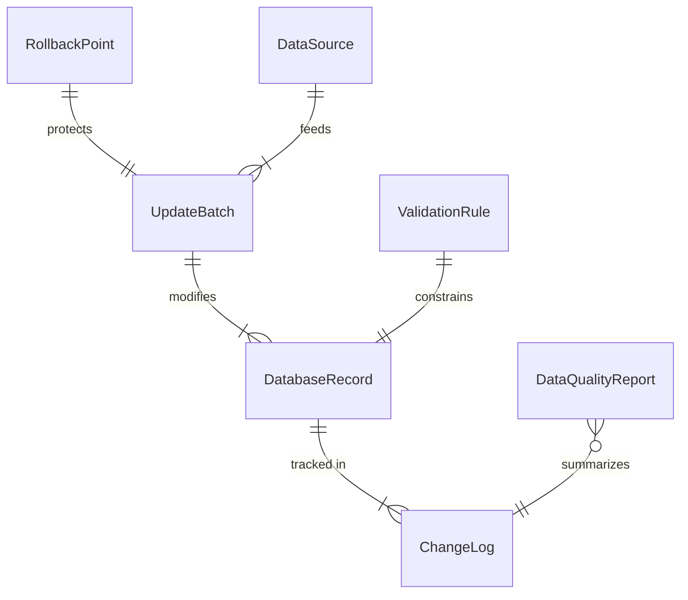
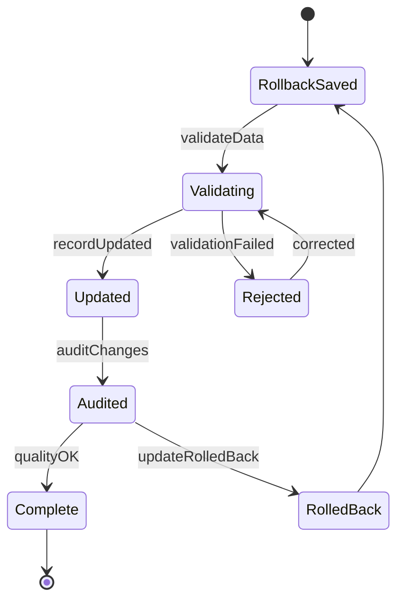
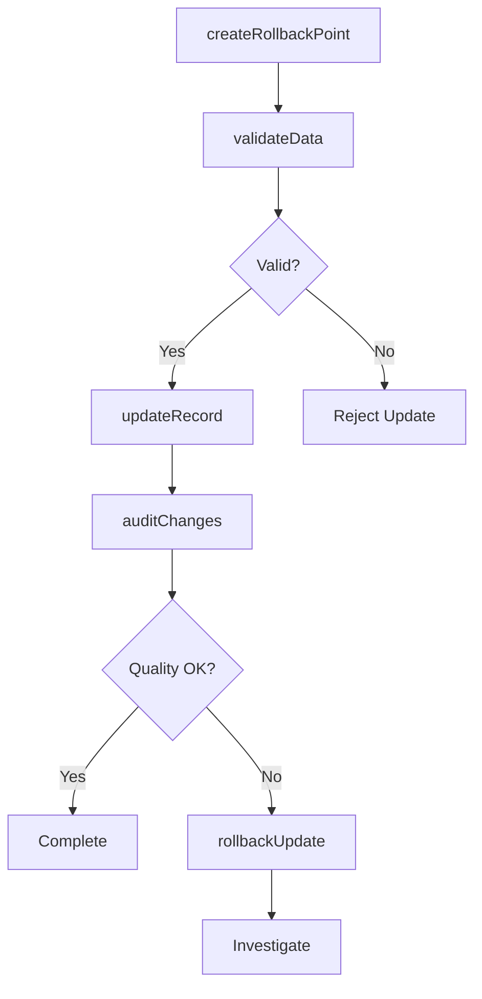
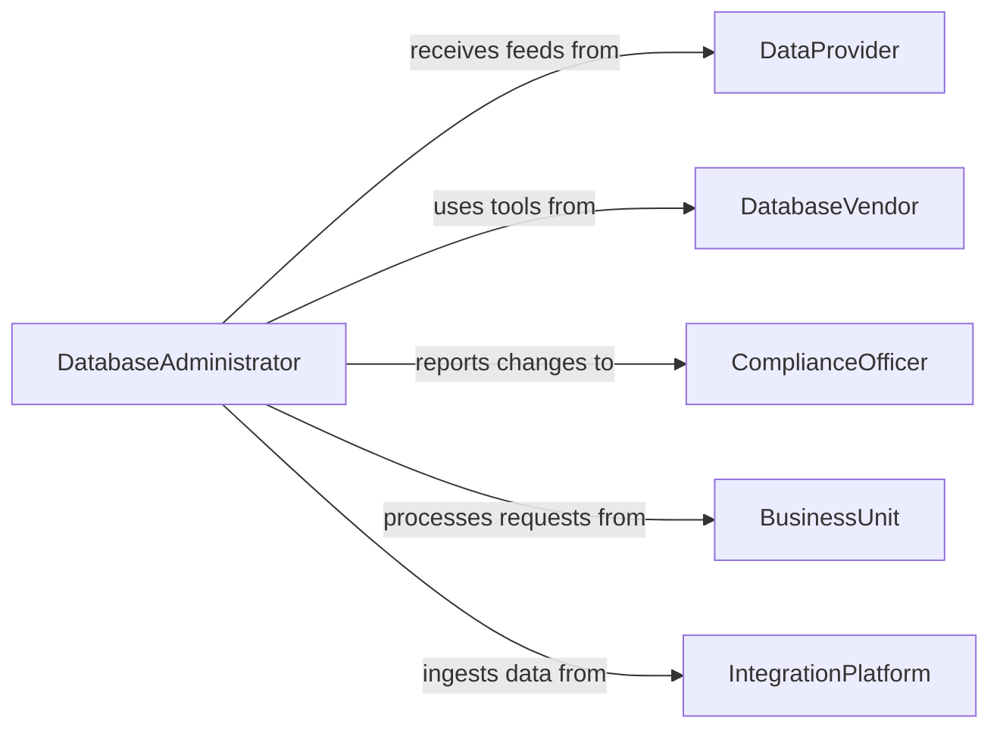

# Update Computer Database Information

> Business-as-Code definition for database record maintenance and data quality management. Models the lifecycle from data validation through update execution, audit logging, and integrity verification.

## Overview

Updating computer database information involves modifying, correcting, and maintaining records across relational databases, document stores, and enterprise data systems. This definition exposes actions for structured data updates and bulk operations, events for change tracking automation, and searches for data quality monitoring and audit trail retrieval.

## Actors

| Actor | Description |
|-------|-------------|
| DataProvider | Supplies source data for updates from external systems |
| DatabaseVendor | Provides database platform support and optimization tools |
| ComplianceOfficer | Ensures data updates comply with privacy and retention policies |
| BusinessUnit | Requests data corrections and updates for operational needs |
| IntegrationPlatform | Delivers automated data feeds requiring database updates |

## Roles

| Role | Description |
|------|-------------|
| DatabaseAdministrator | Executes and oversees database update operations |
| DataAnalyst | Identifies records requiring correction or enrichment |
| DataEntrySpecialist | Performs manual record updates and verifications |
| DataGovernanceLead | Defines policies for data modification and access |

## Entities

| Entity | Description |
|--------|-------------|
| DatabaseRecord | A single row or document in the database |
| UpdateBatch | A grouped set of record modifications applied together |
| ChangeLog | A timestamped record of modifications to database entries |
| ValidationRule | A constraint ensuring updated data meets quality standards |
| DataSource | The origin system providing update values |
| RollbackPoint | A saved state enabling reversal of applied updates |
| DataQualityReport | A summary of data accuracy and completeness metrics |

## Actions

| Action | Description |
|--------|-------------|
| updateRecord | Modify a single database record with new values |
| batchUpdate | Apply changes to multiple records in a single operation |
| validateData | Check proposed updates against quality and integrity rules |
| createRollbackPoint | Save the current database state before applying changes |
| rollbackUpdate | Revert records to a previous state after an error |
| auditChanges | Generate a report of recent modifications with attribution |
| mergeRecords | Combine duplicate records into a single authoritative entry |

## Events

| Event | Description |
|-------|-------------|
| recordUpdated | A database record has been modified |
| batchCompleted | A bulk update operation has finished |
| validationFailed | A proposed update did not meet data quality rules |
| rollbackPointCreated | A restore point has been saved |
| updateRolledBack | Records have been reverted to a prior state |
| duplicateDetected | Potential duplicate records have been identified |
| dataQualityAlerted | Data quality metrics have fallen below threshold |

## Searches

| Search | Description |
|--------|-------------|
| findModifiedRecords | List records changed within a date range or by user |
| getChangeLog | Retrieve the modification history for a specific record |
| findDuplicates | Identify potential duplicate entries by matching fields |
| getDataQualityMetrics | Query accuracy, completeness, and freshness scores |
| getPendingUpdates | List queued updates awaiting validation or approval |

## Entity Relationships



## State Diagram



## Workflow



## Actor Relationships



## Usage

### Calling Actions

```typescript
import { updateComputerDatabaseInformation } from '@headlessly/update-computer-database-information'

const database = updateComputerDatabaseInformation()

// Update a customer record
await database.updateRecord({
  table: 'customers',
  recordId: 'CUST-29481',
  changes: {
    email: 'new-email@company.com',
    phone: '+1-555-0199',
    updatedBy: 'data-ops'
  }
})

// Batch update pricing data
await database.batchUpdate({
  table: 'products',
  filter: { category: 'electronics' },
  changes: { taxRate: 0.0875 },
  dryRun: false
})

// Merge duplicate contacts
await database.mergeRecords({
  table: 'contacts',
  primaryId: 'CONT-1001',
  duplicateIds: ['CONT-1042', 'CONT-1099'],
  mergeStrategy: 'keep-primary'
})
```

### Event-Driven Automation

```typescript
// Alert on validation failures
database.validationFailed(async ({ table, recordId, rule, value }) => {
  await notify({
    to: 'data-quality',
    message: `Validation failed: ${rule} on ${table}/${recordId} (value: ${value})`
  })
})

// Auto-audit on batch completion
database.batchCompleted(async ({ batchId, table, recordCount }) => {
  await database.auditChanges({
    batchId,
    table,
    generateReport: true
  })
})
```
