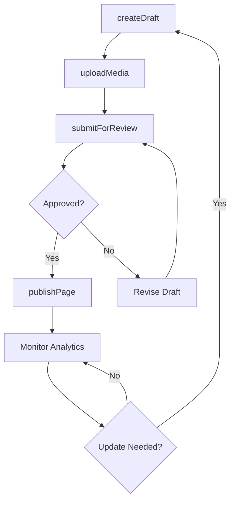
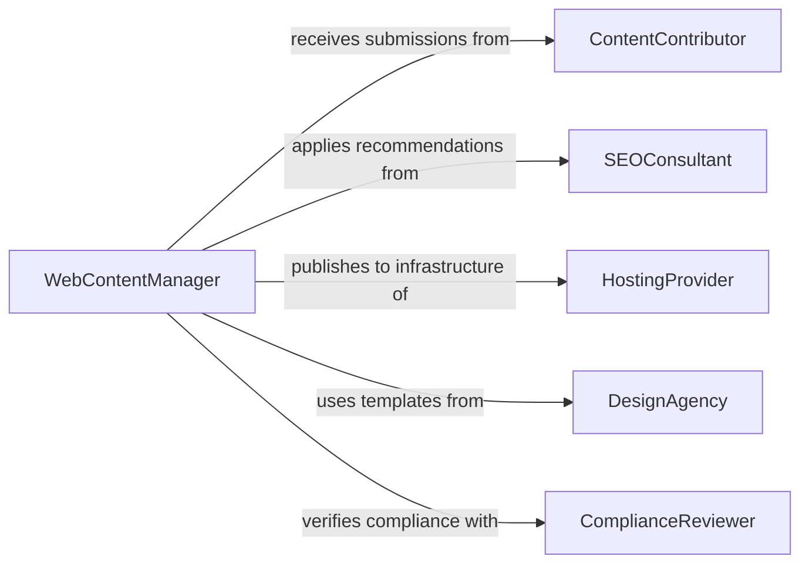

# Update Website Content

> Business-as-Code definition for web content management and publishing. Models the lifecycle from content creation through review, publishing, and performance tracking across websites and digital properties.

## Overview

Updating website content involves creating, editing, approving, and publishing text, images, and multimedia across organizational websites using content management systems. This definition exposes actions for content lifecycle management, events for editorial workflow automation, and searches for content inventory and analytics retrieval.

## Actors

| Actor | Description |
|-------|-------------|
| ContentContributor | Submits articles, media, and page updates for review |
| SEOConsultant | Provides keyword research and optimization recommendations |
| HostingProvider | Delivers web infrastructure and CDN services |
| DesignAgency | Creates visual assets and page templates |
| ComplianceReviewer | Ensures published content meets legal and regulatory standards |
| AnalyticsPlatform | Tracks visitor behavior and content performance |

## Roles

| Role | Description |
|------|-------------|
| WebContentManager | Oversees content strategy and publishing workflows |
| ContentEditor | Reviews and approves submitted content for publication |
| WebDeveloper | Implements technical changes to site templates and features |
| DigitalMarketingSpecialist | Optimizes content for search and engagement |

## Entities

| Entity | Description |
|--------|-------------|
| WebPage | A published page on the website with a unique URL |
| ContentDraft | An unpublished version of page content awaiting review |
| MediaAsset | An image, video, or document attached to web content |
| PublishSchedule | A planned date and time for content to go live |
| ContentTemplate | A reusable page layout defining structure and styling |
| Redirect | A URL mapping from an old page to a new destination |
| SEOMetadata | Title tags, descriptions, and keywords for search optimization |

## Actions

| Action | Description |
|--------|-------------|
| createDraft | Author new content or revise an existing page |
| uploadMedia | Add images, videos, or documents to the media library |
| submitForReview | Send a content draft to the editorial review queue |
| approveContent | Mark a reviewed draft as ready for publication |
| publishPage | Push approved content live on the website |
| schedulePage | Set a future date and time for automatic publication |
| archivePage | Remove a page from the live site and move to archive |

## Events

| Event | Description |
|-------|-------------|
| draftCreated | A new content draft has been authored |
| mediaUploaded | A media asset has been added to the library |
| contentSubmitted | A draft has been sent to the review queue |
| contentApproved | A draft has been marked ready for publication |
| pagePublished | Content has been pushed live on the website |
| pageScheduled | Content has been queued for future publication |
| pageArchived | A page has been removed from the live site |

## Searches

| Search | Description |
|--------|-------------|
| findPages | List web pages by section, author, or publication status |
| getDrafts | Retrieve pending drafts by author or review status |
| getMediaLibrary | Search media assets by type, tag, or upload date |
| getPageAnalytics | Query traffic, engagement, and conversion data by page |
| findBrokenLinks | List pages with broken internal or external links |

## Workflow



## Actor Relationships



## Usage

### Calling Actions

```typescript
import { updateWebsiteContent } from '@headlessly/update-website-content'

const website = updateWebsiteContent()

// Create a new blog post draft
const draft = await website.createDraft({
  section: 'blog',
  title: 'Q1 Product Update',
  body: '<p>We are excited to announce...</p>',
  author: 'marketing-team',
  seo: { title: 'Q1 Product Update | Company Blog', description: 'Latest features and improvements' }
})

// Upload a hero image
await website.uploadMedia({
  draftId: draft.id,
  file: 'hero-q1-update.webp',
  altText: 'Product dashboard screenshot',
  placement: 'hero'
})

// Schedule publication
await website.schedulePage({
  draftId: draft.id,
  publishDate: '2026-03-01T09:00:00Z'
})
```

### Event-Driven Automation

```typescript
// Notify team on publication
website.pagePublished(async ({ pageId, title, url }) => {
  await notify({
    to: 'marketing',
    message: `Published: "${title}" at ${url}`
  })
})

// Auto-check for broken links after content updates
website.contentApproved(async ({ draftId }) => {
  const broken = await website.findBrokenLinks({ draftId })
  if (broken.length > 0) {
    await notify({
      to: 'web-team',
      message: `${broken.length} broken links found in draft ${draftId}`
    })
  }
})
```
