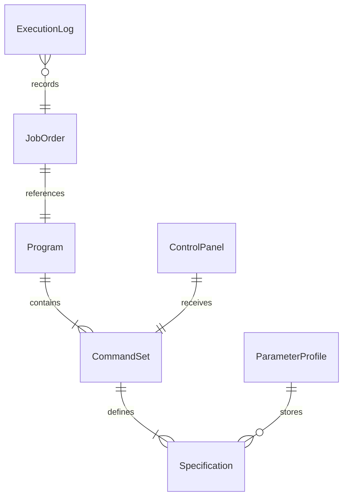
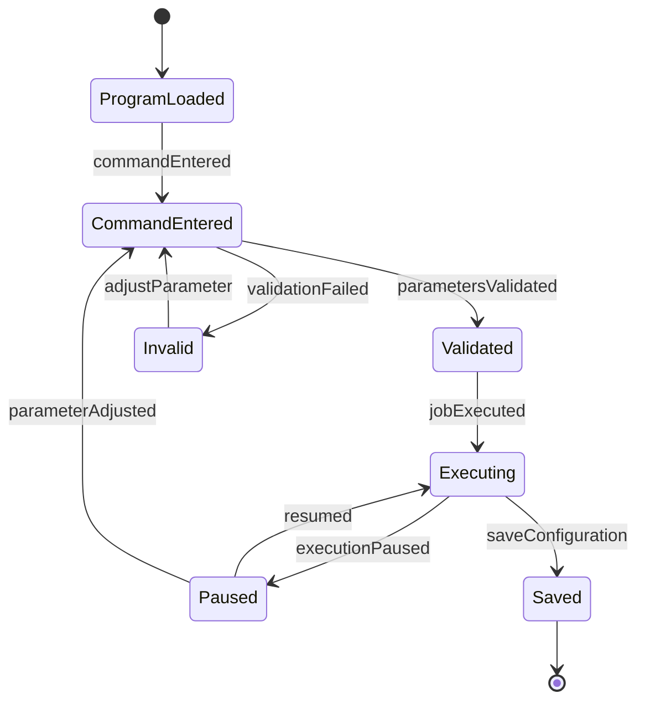
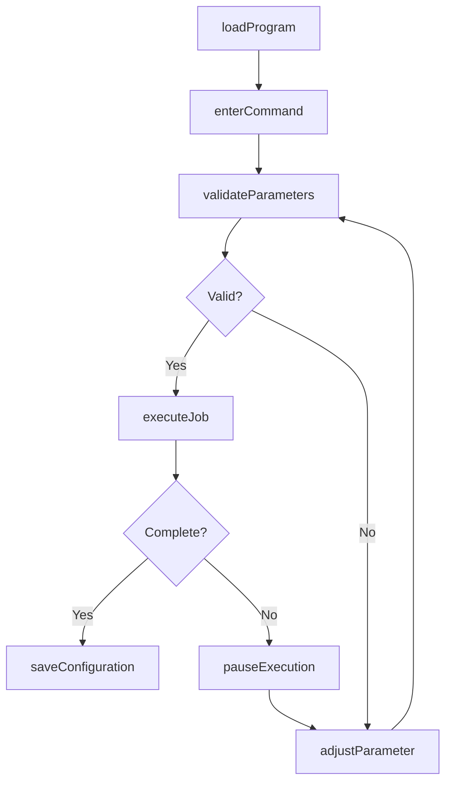
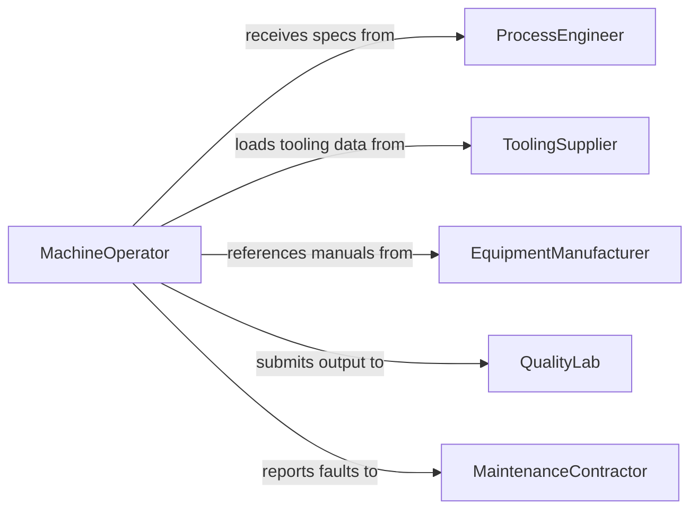

# Enter Commands, Instructions, or Specifications into Equipment

> Business-as-Code definition for command entry and equipment configuration. Models the process of inputting operational parameters, machine instructions, and specification data into programmable systems.

## Overview

Entering commands, instructions, or specifications into equipment involves configuring programmable machinery, CNC systems, and industrial controllers with the operational parameters needed to perform designated tasks. This definition exposes actions for command input, parameter validation, and execution control, events for monitoring job progress, and searches for retrieving configuration history.

## Actors

| Actor | Description |
|-------|-------------|
| EquipmentManufacturer | Provides machine specifications and programming interfaces |
| ToolingSupplier | Delivers tooling data and cutting parameters for operations |
| QualityLab | Validates output produced from entered specifications |
| ProcessEngineer | Defines the operational parameters and tolerances |
| MaintenanceContractor | Services equipment when command entry reveals faults |

## Roles

| Role | Description |
|------|-------------|
| MachineOperator | Enters commands and monitors equipment execution |
| Programmer | Develops and loads instruction sets for automated equipment |
| ProductionSupervisor | Approves job specifications before execution |
| QualityInspector | Verifies output matches entered specifications |

## Entities

| Entity | Description |
|--------|-------------|
| CommandSet | A sequence of instructions loaded into a machine controller |
| Specification | Defined parameters such as dimensions, tolerances, or feed rates |
| Program | A stored set of machine instructions for a specific operation |
| JobOrder | A work order linking specifications to production requirements |
| ControlPanel | The interface through which commands are entered and monitored |
| ParameterProfile | A saved configuration of operating variables |
| ExecutionLog | A record of commands sent and machine responses |

## Actions

| Action | Description |
|--------|-------------|
| enterCommand | Input an instruction or parameter into the equipment controller |
| loadProgram | Transfer a stored program to the machine for execution |
| validateParameters | Check entered values against allowable ranges and tolerances |
| executeJob | Start the machine cycle based on entered instructions |
| pauseExecution | Temporarily halt an in-progress machine operation |
| adjustParameter | Modify a running parameter without stopping the cycle |
| saveConfiguration | Store the current set of parameters as a reusable profile |

## Events

| Event | Description |
|-------|-------------|
| commandEntered | A new instruction has been input to the controller |
| programLoaded | A machine program has been transferred and is ready |
| parametersValidated | Entered values have been confirmed within tolerance |
| jobExecuted | The machine has completed the programmed operation |
| executionPaused | A running operation has been temporarily halted |
| parameterAdjusted | A live operating parameter has been modified |
| validationFailed | Entered parameters fell outside acceptable ranges |

## Searches

| Search | Description |
|--------|-------------|
| findPrograms | List stored programs by machine type, part number, or date |
| getExecutionHistory | Retrieve past job runs by equipment, operator, or date |
| getParameterProfiles | Query saved configuration profiles by name or machine |
| findValidationErrors | List recent parameter entries that failed validation |

## Entity Relationships



## State Diagram



## Workflow



## Actor Relationships



## Usage

### Calling Actions

```typescript
import { enterCommandsInstructionsSpecificationsInto } from '@headlessly/enter-commands-instructions-specifications-into'

const equipment = enterCommandsInstructionsSpecificationsInto()

// Load a CNC program for a part run
await equipment.loadProgram({
  machineId: 'cnc-lathe-04',
  programId: 'PART-7842-REV3',
  source: 'cam-library'
})

// Enter cutting parameters
await equipment.enterCommand({
  machineId: 'cnc-lathe-04',
  parameters: {
    spindleSpeed: 2400,
    feedRate: 0.15,
    depthOfCut: 2.5
  }
})

// Execute the job
const result = await equipment.executeJob({
  machineId: 'cnc-lathe-04',
  jobOrderId: 'JO-2026-0142'
})
```

### Event-Driven Automation

```typescript
// Alert on validation failures
equipment.validationFailed(async ({ machineId, parameter, value, allowedRange }) => {
  await notify({
    to: 'production-floor',
    message: `Parameter ${parameter} = ${value} out of range ${allowedRange} on ${machineId}`
  })
})

// Log all completed jobs for traceability
equipment.jobExecuted(async ({ machineId, jobOrderId, duration }) => {
  await auditLog.record({
    event: 'job-complete',
    machineId,
    jobOrderId,
    duration
  })
})
```
