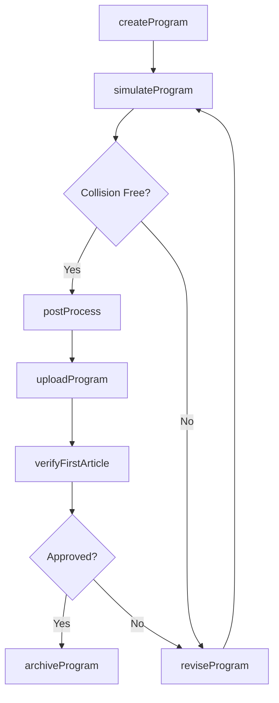
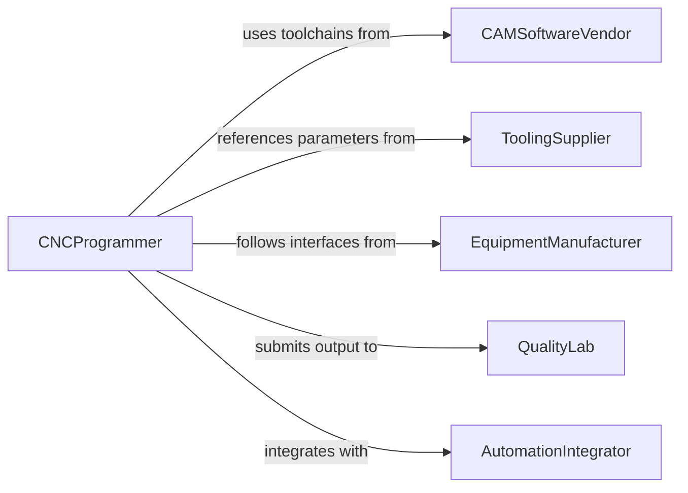

# Program Equipment to Perform Production Tasks

> Business-as-Code definition for production equipment programming and automation. Models the workflow from task specification through program authoring, simulation, and deployment to manufacturing systems.

## Overview

Programming equipment to perform production tasks involves creating, testing, and deploying machine-level instructions that automate manufacturing processes such as CNC machining, robotic assembly, and process control. This definition exposes actions for program development and machine deployment, events for production monitoring, and searches for program management and version tracking.

## Actors

| Actor | Description |
|-------|-------------|
| EquipmentManufacturer | Provides programming interfaces and firmware updates |
| CAMSoftwareVendor | Supplies computer-aided manufacturing toolchains |
| ToolingSupplier | Delivers cutting tools and associated parameter libraries |
| QualityLab | Validates production output against specifications |
| AutomationIntegrator | Connects equipment to supervisory control systems |

## Roles

| Role | Description |
|------|-------------|
| CNCProgrammer | Authors G-code and machine instructions for production equipment |
| ManufacturingEngineer | Defines production processes and programming requirements |
| ProductionSupervisor | Approves programs for deployment to the shop floor |
| SetupTechnician | Loads programs onto machines and verifies initial runs |

## Entities

| Entity | Description |
|--------|-------------|
| MachineProgram | A set of coded instructions that control equipment operations |
| Toolpath | The calculated path a cutting tool follows during machining |
| Simulation | A virtual execution of a program to verify correctness |
| ProductionRun | A batch of parts manufactured using a specific program |
| PostProcessor | A translator that converts CAM output to machine-specific code |
| FixtureSetup | The physical arrangement of workholding for a production task |
| ProgramVersion | A tracked revision of a machine program |

## Actions

| Action | Description |
|--------|-------------|
| createProgram | Author a new set of machine instructions for a production task |
| simulateProgram | Run a virtual execution to detect collisions or errors |
| postProcess | Convert CAM toolpaths into machine-specific G-code |
| uploadProgram | Transfer the program to the target equipment controller |
| verifyFirstArticle | Run the program on a test piece to validate output |
| reviseProgram | Update an existing program to reflect design changes |
| archiveProgram | Store a finalized program version for future retrieval |

## Events

| Event | Description |
|-------|-------------|
| programCreated | A new machine program has been authored |
| simulationCompleted | Virtual execution of the program has finished |
| collisionDetected | The simulation identified a tool or fixture collision |
| programUploaded | The program has been transferred to the machine controller |
| firstArticleApproved | The initial production piece has passed quality inspection |
| programRevised | An existing program has been updated with changes |
| programArchived | A finalized program has been stored for reuse |

## Searches

| Search | Description |
|--------|-------------|
| findPrograms | List machine programs by part number, machine, or author |
| getSimulationResults | Retrieve simulation outcomes by program or date |
| getProgramVersions | Query revision history for a specific program |
| findProductionRuns | List production batches by program, date, or quantity |
| getToolpathData | Retrieve toolpath geometry and parameters for a program |

## Workflow



## Actor Relationships



## Usage

### Calling Actions

```typescript
import { programEquipmentPerformProductionTasks } from '@headlessly/program-equipment-perform-production-tasks'

const production = programEquipmentPerformProductionTasks()

// Create a CNC program for a bracket
const program = await production.createProgram({
  partNumber: 'BRK-4200',
  machine: 'haas-vf2',
  material: 'aluminum-6061',
  operations: ['face', 'pocket', 'drill', 'chamfer']
})

// Simulate before uploading
const sim = await production.simulateProgram({
  programId: program.id,
  checkCollisions: true,
  checkToolReach: true
})

// Upload to the machine
await production.uploadProgram({
  programId: program.id,
  machineId: 'haas-vf2-bay3',
  slot: 'O0042'
})
```

### Event-Driven Automation

```typescript
// Alert on collision detection
production.collisionDetected(async ({ programId, collisionType, location }) => {
  await notify({
    to: 'cnc-programming',
    message: `Collision detected in ${programId}: ${collisionType} at ${location}`
  })
})

// Archive after first article approval
production.firstArticleApproved(async ({ programId, partNumber }) => {
  await production.archiveProgram({
    programId,
    label: `${partNumber}-production-release`
  })
})
```
