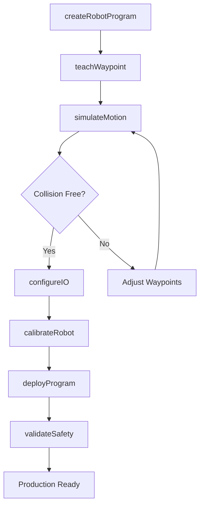
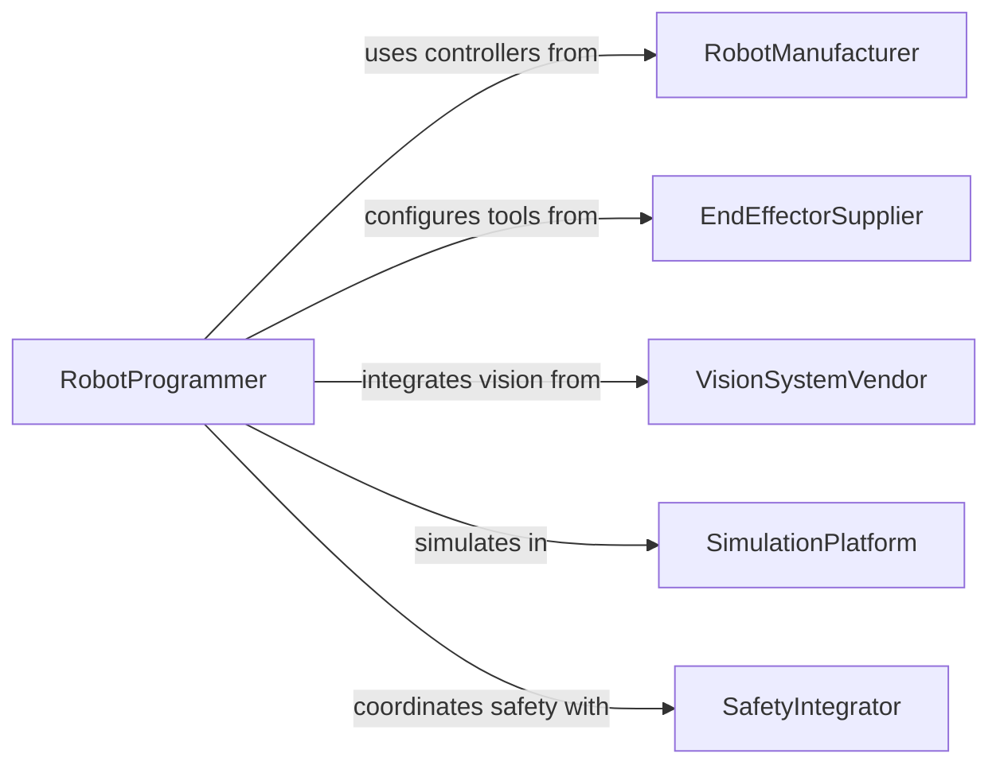

# Program Robotic Equipment

> Business-as-Code definition for robotic systems programming and automation. Models the lifecycle from motion planning through teach-pendant programming, simulation, and deployment to production cells.

## Overview

Programming robotic equipment involves defining motion sequences, configuring end-effector operations, and deploying control logic to industrial robots for tasks such as welding, assembly, palletizing, and material handling. This definition exposes actions for robot programming and cell configuration, events for runtime monitoring, and searches for program and performance management.

## Actors

| Actor | Description |
|-------|-------------|
| RobotManufacturer | Provides controllers, firmware, and programming environments |
| EndEffectorSupplier | Delivers grippers, welding torches, and tool-changing systems |
| SafetyIntegrator | Designs safety zones, light curtains, and emergency stop systems |
| VisionSystemVendor | Supplies cameras and machine vision for guided robot operations |
| SimulationPlatform | Provides offline programming and digital twin environments |

## Roles

| Role | Description |
|------|-------------|
| RobotProgrammer | Authors motion sequences and control logic for robotic systems |
| AutomationEngineer | Designs the robotic cell layout and integration points |
| SafetyEngineer | Validates that robot programs comply with safety requirements |
| CellOperator | Monitors robotic operations and intervenes when needed |

## Entities

| Entity | Description |
|--------|-------------|
| RobotProgram | A set of motion instructions and logic controlling a robot |
| MotionPath | A defined trajectory the robot arm follows during operation |
| Waypoint | A specific position and orientation in the robot workspace |
| EndEffector | The tool attached to the robot for task execution |
| SafetyZone | A defined area with restricted robot speed or access |
| DigitalTwin | A virtual replica of the robot cell for offline programming |
| IOMapping | The configuration linking robot signals to peripheral devices |

## Actions

| Action | Description |
|--------|-------------|
| createRobotProgram | Author a new sequence of robot motions and logic |
| teachWaypoint | Record a position using the teach pendant or manual guidance |
| simulateMotion | Run the program in a digital twin to verify paths |
| deployProgram | Transfer the program to the robot controller |
| calibrateRobot | Align the robot coordinate system with the physical workspace |
| configureIO | Map digital and analog signals between the robot and peripherals |
| validateSafety | Test emergency stops, speed limits, and zone compliance |

## Events

| Event | Description |
|-------|-------------|
| programCreated | A new robot program has been authored |
| waypointTaught | A position has been recorded in the program |
| simulationPassed | Offline simulation completed without collisions or errors |
| programDeployed | The program has been loaded onto the robot controller |
| robotCalibrated | The coordinate system has been aligned to the workspace |
| safetyValidated | Safety checks have passed for the programmed cell |
| collisionRiskDetected | Simulation identified a potential collision in the motion path |

## Searches

| Search | Description |
|--------|-------------|
| findRobotPrograms | List programs by robot model, task type, or author |
| getMotionPaths | Retrieve trajectory data for a specific program |
| getCalibrationHistory | Query past calibration records by robot and date |
| findSafetyViolations | List safety validation failures by cell or program |
| getCycleTimeMetrics | Retrieve execution timing data across production runs |

## Workflow



## Actor Relationships



## Usage

### Calling Actions

```typescript
import { programRoboticEquipment } from '@headlessly/program-robotic-equipment'

const robotics = programRoboticEquipment()

// Create a palletizing program
const program = await robotics.createRobotProgram({
  robotId: 'fanuc-m710ic',
  taskType: 'palletize',
  payload: { weight: 25, dimensions: { l: 400, w: 300, h: 200 } }
})

// Teach pick and place positions
await robotics.teachWaypoint({
  programId: program.id,
  name: 'pick-conveyor',
  position: { x: 1200, y: 0, z: 850, rx: 0, ry: 180, rz: 0 }
})

// Simulate and deploy
const sim = await robotics.simulateMotion({ programId: program.id })
if (sim.collisionFree) {
  await robotics.deployProgram({ programId: program.id, controllerId: 'fanuc-r30ib-04' })
}
```

### Event-Driven Automation

```typescript
// Alert on collision risk during simulation
robotics.collisionRiskDetected(async ({ programId, waypointName, clearance }) => {
  await notify({
    to: 'automation-team',
    message: `Collision risk at ${waypointName} in ${programId}, clearance: ${clearance}mm`
  })
})

// Log deployment for audit trail
robotics.programDeployed(async ({ programId, robotId, deployedBy }) => {
  await auditLog.record({
    event: 'robot-program-deployed',
    programId,
    robotId,
    deployedBy
  })
})
```
