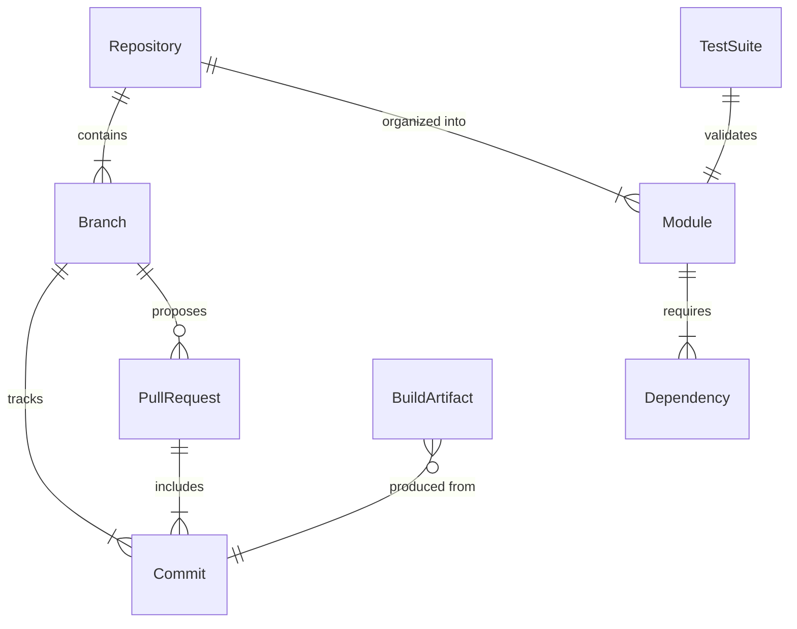
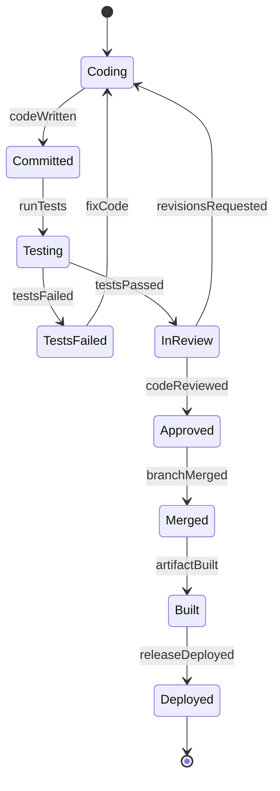
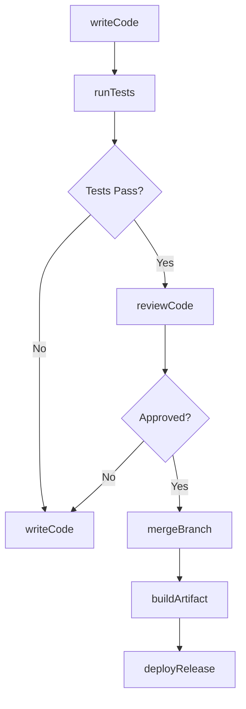
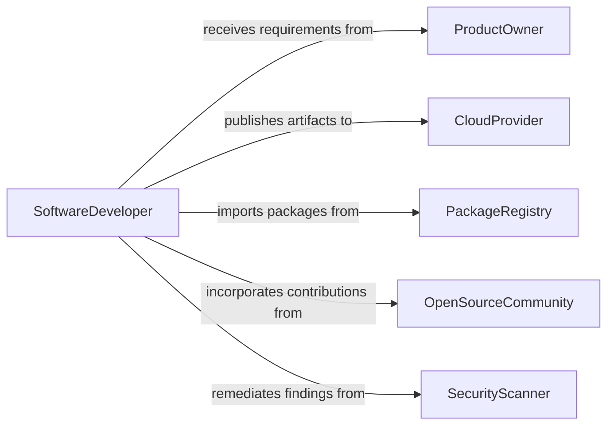

# Write Computer Programming Code

> Business-as-Code definition for software development and code authoring. Models the complete lifecycle from requirements analysis through code writing, review, and deployment.

## Overview

Writing computer programming code encompasses the design, authoring, testing, and maintenance of software applications across programming languages and platforms. This definition exposes actions for each stage of the development workflow, events for CI/CD automation, and searches for codebase navigation and dependency tracking.

## Actors

| Actor | Description |
|-------|-------------|
| ProductOwner | Defines feature requirements and acceptance criteria |
| EndUser | Consumes the software and provides feedback on functionality |
| OpenSourceCommunity | Contributes libraries, frameworks, and code reviews |
| CloudProvider | Hosts infrastructure and deployment targets |
| PackageRegistry | Distributes and versions software dependencies |
| SecurityScanner | Evaluates code for vulnerabilities and compliance risks |

## Roles

| Role | Description |
|------|-------------|
| SoftwareDeveloper | Authors, tests, and maintains application source code |
| TechLead | Reviews architecture decisions and approves merge requests |
| QAEngineer | Validates code through automated and manual testing |
| DevOpsEngineer | Manages build pipelines and deployment infrastructure |

## Entities

| Entity | Description |
|--------|-------------|
| Repository | A version-controlled collection of source code files |
| Branch | An isolated line of development within a repository |
| PullRequest | A proposed set of code changes submitted for review |
| Commit | A recorded snapshot of changes to the codebase |
| Module | A reusable unit of code with defined interfaces |
| TestSuite | A collection of automated tests validating code behavior |
| BuildArtifact | A compiled or packaged output ready for deployment |
| Dependency | An external library or package required by the project |

## Actions

| Action | Description |
|--------|-------------|
| writeCode | Author new source code for a feature or fix |
| refactorCode | Restructure existing code without changing behavior |
| reviewCode | Evaluate a pull request for quality and correctness |
| runTests | Execute automated test suites against code changes |
| mergeBranch | Integrate approved changes into the main branch |
| buildArtifact | Compile and package code into deployable artifacts |
| deployRelease | Push build artifacts to staging or production environments |
| resolveConflict | Reconcile divergent changes between branches |

## Events

| Event | Description |
|-------|-------------|
| codeWritten | New source code has been committed to a branch |
| codeReviewed | A pull request has completed peer review |
| testsPassed | All automated tests have passed successfully |
| testsFailed | One or more automated tests have failed |
| branchMerged | A feature branch has been integrated into the main branch |
| artifactBuilt | A deployable build artifact has been produced |
| releaseDeployed | A new version has been deployed to an environment |
| conflictDetected | Merge conflicts have been identified between branches |

## Searches

| Search | Description |
|--------|-------------|
| findRepositories | List repositories by language, team, or activity |
| getPullRequests | Retrieve open or merged pull requests by author or status |
| getCommitHistory | Query commit logs by date range, author, or file path |
| findDependencies | List external packages and their current versions |
| getTestResults | Retrieve test execution results by suite or build |
| searchCodebase | Full-text search across source files and documentation |

## Entity Relationships



## State Diagram



## Workflow



## Actor Relationships



## Usage

### Calling Actions

```typescript
import { writeComputerProgrammingCode } from '@headlessly/write-computer-programming-code'

const codebase = writeComputerProgrammingCode()

// Author a new feature module
const commit = await codebase.writeCode({
  repository: 'platform-api',
  branch: 'feat/user-auth',
  files: [
    { path: 'src/auth/handler.ts', content: '...' },
    { path: 'src/auth/middleware.ts', content: '...' }
  ],
  message: 'Add JWT-based authentication handler'
})

// Run the test suite
const results = await codebase.runTests({
  repository: 'platform-api',
  branch: 'feat/user-auth',
  suite: 'unit'
})

// Merge after approval
await codebase.mergeBranch({
  repository: 'platform-api',
  pullRequestId: 'PR-142',
  strategy: 'squash'
})
```

### Event-Driven Automation

```typescript
// Auto-deploy on successful merge
codebase.branchMerged(async ({ repository, branch }) => {
  if (branch === 'main') {
    await codebase.buildArtifact({ repository, target: 'production' })
  }
})

// Notify team on test failures
codebase.testsFailed(async ({ repository, branch, failures }) => {
  await notify({
    to: 'engineering',
    message: `${failures.length} tests failed on ${repository}/${branch}`
  })
})
```
