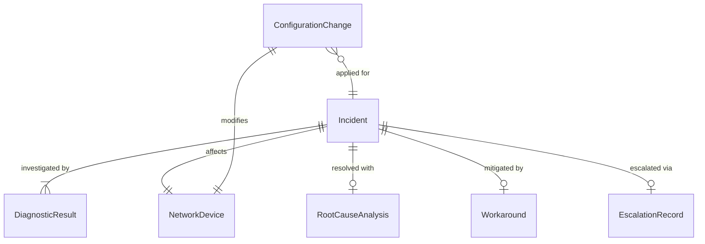
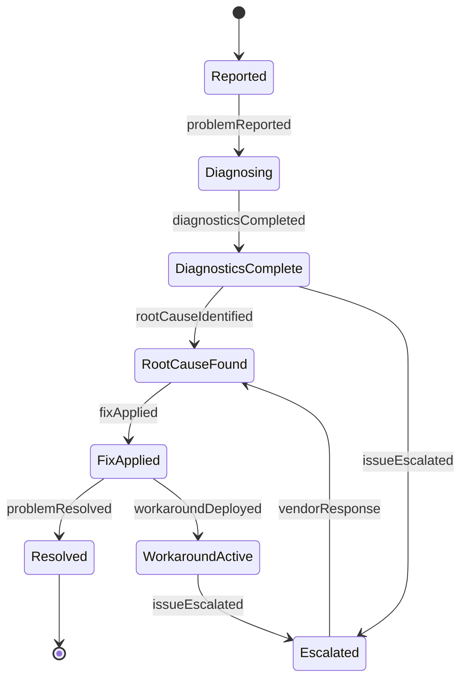
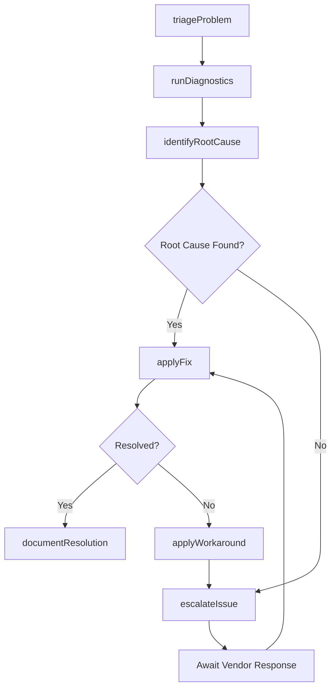
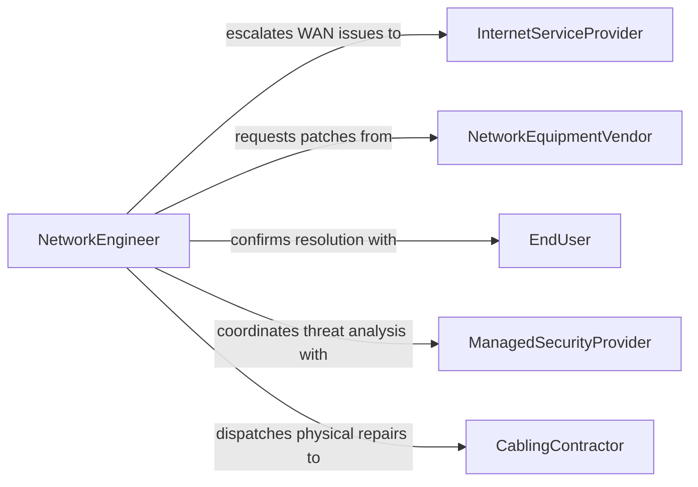

# Resolve Computer Network Problems

> Business-as-Code definition for network troubleshooting and incident resolution. Models the workflow from problem detection through diagnosis, remediation, and root cause documentation.

## Overview

Resolving computer network problems involves diagnosing connectivity failures, latency issues, configuration errors, and security breaches across LANs, WANs, and cloud networks. This definition exposes actions for structured troubleshooting, events for incident lifecycle tracking, and searches for historical problem patterns and resolution data.

## Actors

| Actor | Description |
|-------|-------------|
| InternetServiceProvider | Escalation target for WAN and circuit-level connectivity issues |
| NetworkEquipmentVendor | Provides technical support and firmware patches for devices |
| EndUser | Reports network problems and confirms resolution |
| ManagedSecurityProvider | Assists with network intrusion and threat-related outages |
| CablingContractor | Addresses physical layer issues in network infrastructure |

## Roles

| Role | Description |
|------|-------------|
| NetworkEngineer | Diagnoses and resolves complex network infrastructure issues |
| HelpdeskAnalyst | Receives initial problem reports and performs triage |
| SecurityAnalyst | Investigates network problems with potential security causes |
| NetworkAdministrator | Implements configuration changes to restore service |

## Entities

| Entity | Description |
|--------|-------------|
| Incident | A reported network problem requiring investigation |
| DiagnosticResult | Output from network testing and analysis tools |
| NetworkDevice | The switch, router, or firewall involved in the problem |
| ConfigurationChange | A modification applied to resolve the issue |
| RootCauseAnalysis | A documented determination of the underlying failure |
| Workaround | A temporary measure to restore service pending a permanent fix |
| EscalationRecord | Documentation of a problem referred to an external party |

## Actions

| Action | Description |
|--------|-------------|
| triageProblem | Categorize and prioritize the reported network issue |
| runDiagnostics | Execute network tests such as ping, traceroute, or packet capture |
| identifyRootCause | Analyze diagnostic results to determine the failure origin |
| applyFix | Implement a configuration change or replacement to resolve the issue |
| applyWorkaround | Deploy a temporary solution to restore connectivity |
| escalateIssue | Refer the problem to a vendor or service provider |
| documentResolution | Record the root cause, fix applied, and preventive recommendations |

## Events

| Event | Description |
|-------|-------------|
| problemReported | A network issue has been submitted for investigation |
| diagnosticsCompleted | Network tests have finished and results are available |
| rootCauseIdentified | The underlying cause of the problem has been determined |
| fixApplied | A remediation has been implemented on the network |
| workaroundDeployed | A temporary measure has been put in place |
| issueEscalated | The problem has been referred to an external support team |
| problemResolved | The network issue has been confirmed fixed |

## Searches

| Search | Description |
|--------|-------------|
| findOpenIncidents | List unresolved network problems by priority or age |
| getDiagnosticHistory | Retrieve past diagnostic results for a device or segment |
| findRecurringProblems | Identify network issues that have occurred multiple times |
| getResolutionMetrics | Query mean time to resolve and escalation rates |
| searchKnowledgeBase | Find documented solutions for similar past problems |

## Entity Relationships



## State Diagram



## Workflow



## Actor Relationships



## Usage

### Calling Actions

```typescript
import { resolveComputerNetworkProblems } from '@headlessly/resolve-computer-network-problems'

const networkSupport = resolveComputerNetworkProblems()

// Triage an incoming problem
const incident = await networkSupport.triageProblem({
  reportedBy: 'user@company.com',
  description: 'Cannot access internal applications from Building B',
  severity: 'high',
  affectedSegment: 'vlan-200'
})

// Run diagnostics
const diag = await networkSupport.runDiagnostics({
  incidentId: incident.id,
  tests: ['ping', 'traceroute', 'port-scan'],
  targetHost: '10.10.200.1'
})

// Apply fix based on findings
await networkSupport.applyFix({
  incidentId: incident.id,
  action: 'restore-vlan-trunk',
  device: 'dist-sw-bldgb-01',
  interface: 'Gi1/0/24'
})
```

### Event-Driven Automation

```typescript
// Auto-escalate aged incidents
networkSupport.problemReported(async ({ incidentId, severity, reportedAt }) => {
  setTimeout(async () => {
    const incident = await networkSupport.findOpenIncidents({ id: incidentId })
    if (incident.status === 'open') {
      await networkSupport.escalateIssue({ incidentId, reason: 'SLA breach' })
    }
  }, severity === 'critical' ? 900000 : 3600000)
})

// Detect recurring patterns
networkSupport.problemResolved(async ({ incidentId, rootCause, deviceId }) => {
  const recurring = await networkSupport.findRecurringProblems({ deviceId, rootCause })
  if (recurring.count > 3) {
    await notify({
      to: 'network-engineering',
      message: `Recurring issue on ${deviceId}: ${rootCause} (${recurring.count} occurrences)`
    })
  }
})
```
