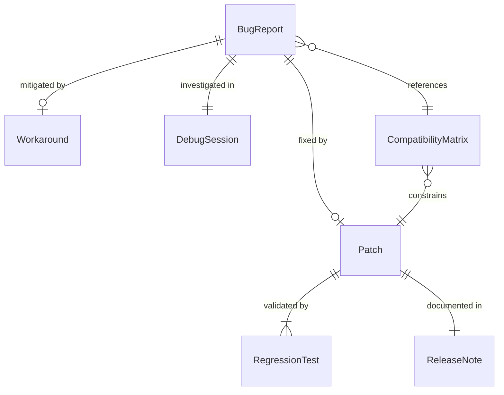
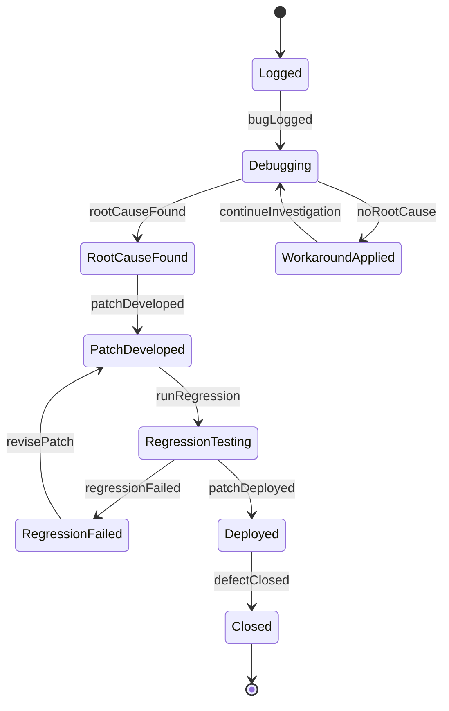
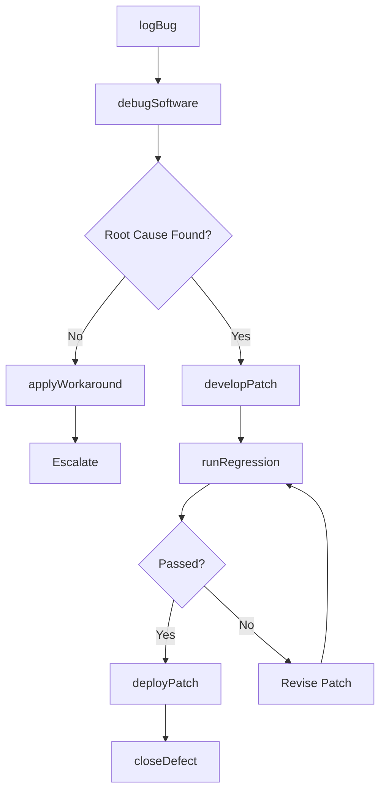
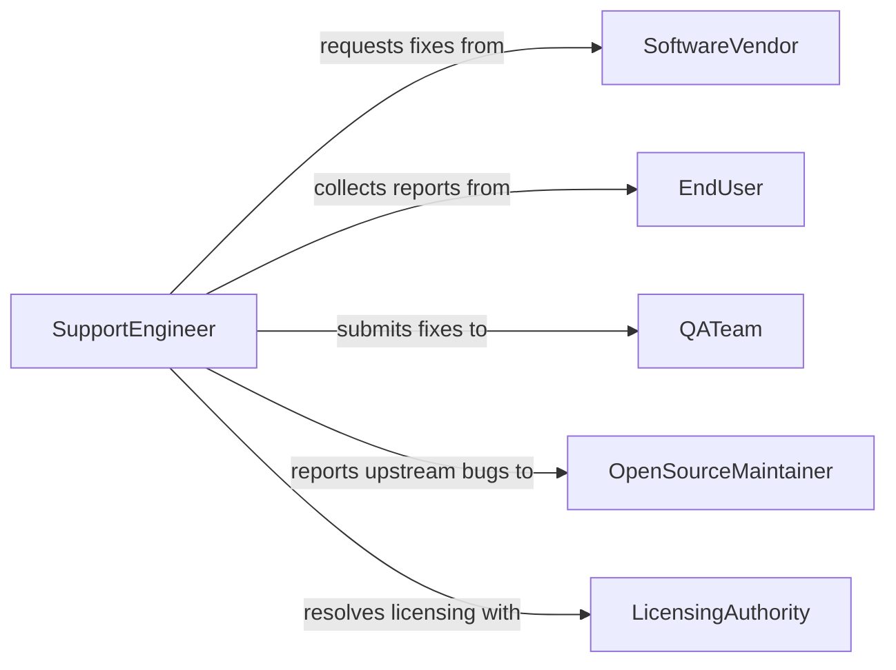

# Resolve Computer Software Problems

> Business-as-Code definition for software problem diagnosis and resolution. Models the workflow from defect identification through debugging, patching, and regression verification.

## Overview

Resolving computer software problems involves diagnosing bugs, crashes, compatibility issues, and configuration errors in operating systems, applications, and middleware. This definition exposes actions for systematic debugging and patch deployment, events for defect tracking automation, and searches for known issues and resolution patterns.

## Actors

| Actor | Description |
|-------|-------------|
| SoftwareVendor | Releases patches and provides technical support for products |
| EndUser | Reports software defects and confirms successful resolution |
| QATeam | Validates patches and verifies regression testing results |
| OpenSourceMaintainer | Manages bug reports and fixes for open-source dependencies |
| LicensingAuthority | Resolves activation and entitlement issues |

## Roles

| Role | Description |
|------|-------------|
| SoftwareEngineer | Debugs code and develops fixes for identified defects |
| SupportEngineer | Diagnoses customer-reported software issues and applies workarounds |
| ReleaseManager | Coordinates patch packaging and deployment schedules |
| QAAnalyst | Executes regression tests to validate applied fixes |

## Entities

| Entity | Description |
|--------|-------------|
| BugReport | A documented description of a software defect |
| Patch | A code change that corrects a specific software problem |
| Workaround | A temporary procedure that bypasses the defect |
| RegressionTest | A test validating that a fix does not introduce new problems |
| DebugSession | An interactive investigation of software behavior |
| ReleaseNote | Documentation describing the fix and affected versions |
| CompatibilityMatrix | A mapping of software versions to supported environments |

## Actions

| Action | Description |
|--------|-------------|
| logBug | Record a new software defect with reproduction steps |
| debugSoftware | Investigate the root cause of a software defect |
| developPatch | Write and test a code fix for the identified problem |
| deployPatch | Push the fix to affected environments |
| applyWorkaround | Implement a temporary bypass pending a permanent fix |
| runRegression | Execute test suites to verify the fix and check for side effects |
| closeDefect | Mark the bug as resolved after verification |

## Events

| Event | Description |
|-------|-------------|
| bugLogged | A new software defect has been documented |
| rootCauseFound | The underlying cause of the defect has been identified |
| patchDeveloped | A code fix has been written and passed initial testing |
| patchDeployed | The fix has been pushed to the target environment |
| regressionPassed | All regression tests have passed after the fix |
| regressionFailed | The fix introduced unexpected side effects |
| defectClosed | The software problem has been confirmed resolved |

## Searches

| Search | Description |
|--------|-------------|
| findOpenBugs | List unresolved software defects by severity or component |
| getDefectHistory | Retrieve past bugs for a specific software module |
| findKnownIssues | Search for documented defects matching a symptom pattern |
| getPatchStatus | Check deployment status of a specific patch across environments |
| getRegressionResults | Query test outcomes for a given patch or release |

## Entity Relationships



## State Diagram



## Workflow



## Actor Relationships



## Usage

### Calling Actions

```typescript
import { resolveComputerSoftwareProblems } from '@headlessly/resolve-computer-software-problems'

const bugfix = resolveComputerSoftwareProblems()

// Log a new bug
const bug = await bugfix.logBug({
  application: 'payroll-system',
  version: '4.2.1',
  description: 'Overtime calculations incorrect for salaried employees',
  severity: 'critical',
  stepsToReproduce: ['Navigate to payroll run', 'Select salaried group', 'Run calculation']
})

// Debug and develop a fix
const session = await bugfix.debugSoftware({
  bugId: bug.id,
  environment: 'staging',
  breakpoints: ['src/payroll/overtime.ts:142']
})

// Deploy the patch
await bugfix.deployPatch({
  bugId: bug.id,
  patchId: 'PAY-4.2.2-hotfix',
  targets: ['staging', 'production']
})
```

### Event-Driven Automation

```typescript
// Auto-run regression on patch development
bugfix.patchDeveloped(async ({ patchId, affectedModules }) => {
  await bugfix.runRegression({
    patchId,
    suites: affectedModules.map(m => `${m}-regression`)
  })
})

// Notify stakeholders on deployment
bugfix.patchDeployed(async ({ patchId, environment, bugId }) => {
  await notify({
    to: 'engineering',
    message: `Patch ${patchId} deployed to ${environment} for bug ${bugId}`
  })
})
```
