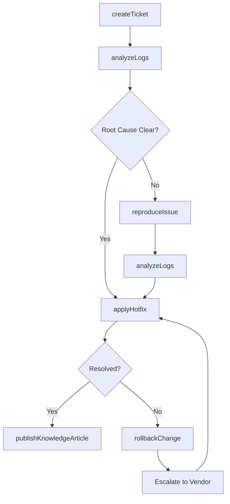
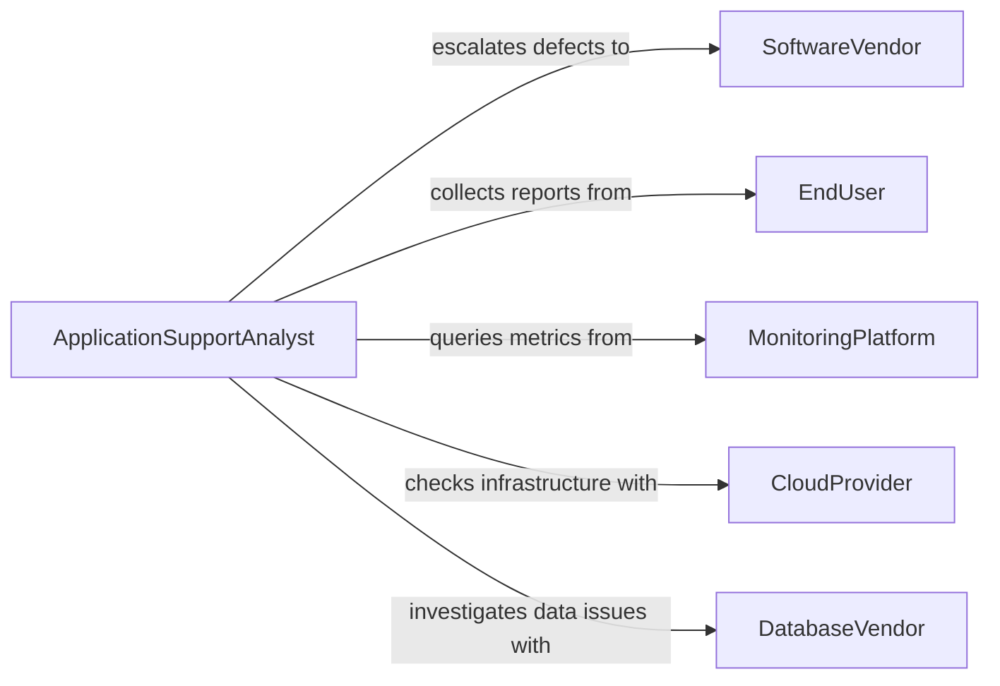

# Troubleshoot Issues with Computer Applications or Systems

> Business-as-Code definition for application and system troubleshooting. Models the diagnostic workflow from issue intake through log analysis, resolution, and knowledge base documentation.

## Overview

Troubleshooting issues with computer applications or systems involves identifying, diagnosing, and resolving software crashes, performance degradation, integration failures, and data errors across enterprise applications. This definition exposes actions for structured diagnostic workflows, events for incident tracking, and searches for error pattern analysis and resolution history.

## Actors

| Actor | Description |
|-------|-------------|
| SoftwareVendor | Provides patches, hotfixes, and technical support for applications |
| EndUser | Reports application problems and validates fixes |
| CloudProvider | Hosts infrastructure where applications run |
| DatabaseVendor | Supports database engine issues affecting applications |
| MonitoringPlatform | Delivers observability data for application health |

## Roles

| Role | Description |
|------|-------------|
| ApplicationSupportAnalyst | Investigates and resolves application-level issues |
| SystemAdministrator | Addresses OS and infrastructure problems affecting applications |
| DeveloperOnCall | Debugs application code defects identified during troubleshooting |
| ServiceDeskAgent | Handles initial intake and categorization of reported issues |

## Entities

| Entity | Description |
|--------|-------------|
| SupportTicket | A tracked record of a reported application issue |
| ErrorLog | System or application log entries related to the problem |
| StackTrace | A detailed execution trace captured during an application error |
| KnowledgeArticle | A documented solution for a known application issue |
| Hotfix | A targeted code patch addressing a specific defect |
| PerformanceMetric | CPU, memory, or response time data for the affected system |
| ConfigurationSnapshot | A captured state of application settings at the time of failure |

## Actions

| Action | Description |
|--------|-------------|
| createTicket | Log a new support ticket for the reported issue |
| analyzeLogs | Review error logs and stack traces to identify failure patterns |
| reproduceIssue | Attempt to recreate the problem in a controlled environment |
| applyHotfix | Deploy a targeted patch to resolve a specific defect |
| restartService | Restart an application or service to clear transient failures |
| rollbackChange | Revert a recent deployment or configuration change |
| publishKnowledgeArticle | Document the solution for future reference |

## Events

| Event | Description |
|-------|-------------|
| ticketCreated | A new support ticket has been logged for investigation |
| logsAnalyzed | Error logs have been reviewed and findings are available |
| issueReproduced | The reported problem has been recreated in a test environment |
| hotfixApplied | A targeted patch has been deployed to the affected system |
| serviceRestarted | An application service has been restarted |
| changeRolledBack | A recent deployment has been reverted |
| issueResolved | The application problem has been confirmed fixed |

## Searches

| Search | Description |
|--------|-------------|
| findOpenTickets | List unresolved support tickets by application or priority |
| getErrorLogs | Retrieve recent error entries by application or severity |
| searchKnowledgeBase | Find documented solutions matching error patterns |
| getPerformanceData | Query application performance metrics by time range |
| findRecentChanges | List deployments or configuration changes in a time window |

## Workflow



## Actor Relationships



## Usage

### Calling Actions

```typescript
import { troubleshootIssuesComputerApplicationsSystems } from '@headlessly/troubleshoot-issues-computer-applications-systems'

const support = troubleshootIssuesComputerApplicationsSystems()

// Create a support ticket
const ticket = await support.createTicket({
  application: 'inventory-management',
  reportedBy: 'warehouse-ops@company.com',
  description: 'Application freezes when generating monthly reports',
  severity: 'high'
})

// Analyze application logs
const findings = await support.analyzeLogs({
  ticketId: ticket.id,
  application: 'inventory-management',
  timeRange: { start: '2026-02-04T00:00:00Z', end: '2026-02-05T00:00:00Z' },
  filter: 'ERROR'
})

// Apply a hotfix
await support.applyHotfix({
  ticketId: ticket.id,
  patchId: 'INV-MGMT-2026.02.1',
  target: 'production'
})
```

### Event-Driven Automation

```typescript
// Auto-restart on repeated crashes
support.ticketCreated(async ({ application, severity }) => {
  if (severity === 'critical') {
    await support.restartService({ application })
  }
})

// Publish knowledge article on resolution
support.issueResolved(async ({ ticketId, rootCause, resolution }) => {
  await support.publishKnowledgeArticle({
    title: `Resolution: ${rootCause}`,
    content: resolution,
    linkedTicket: ticketId
  })
})
```
