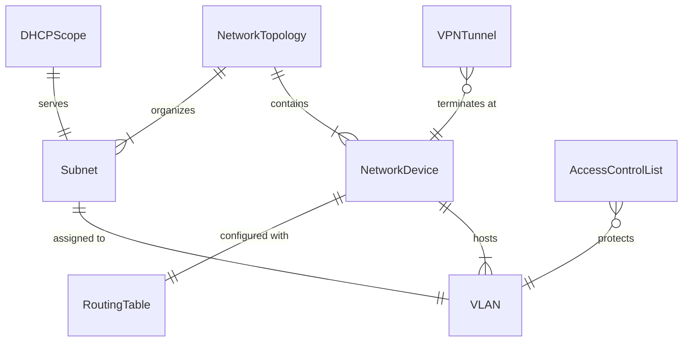
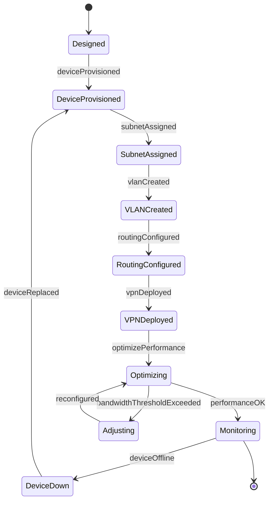
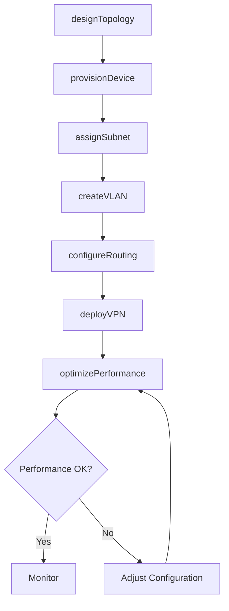
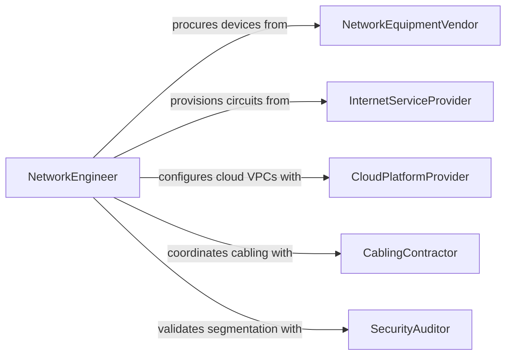

# Configure Computer Networks

> Business-as-Code definition for network infrastructure configuration and management. Models the lifecycle from topology design through device provisioning, routing, and ongoing optimization.

## Overview

Configuring computer networks involves designing network topologies, provisioning switches and routers, establishing IP addressing schemes, and tuning performance across LANs, WANs, and cloud environments. This definition exposes actions for device configuration and traffic management, events for network health monitoring, and searches for topology discovery and performance analysis.

## Actors

| Actor | Description |
|-------|-------------|
| NetworkEquipmentVendor | Manufactures and supports switches, routers, and access points |
| InternetServiceProvider | Provides WAN connectivity and bandwidth services |
| CloudPlatformProvider | Hosts virtual network infrastructure and VPN endpoints |
| CablingContractor | Installs physical network cabling and patch panels |
| SecurityAuditor | Evaluates network segmentation and access controls |
| TelecommunicationsCarrier | Provides circuit and leased-line services |

## Roles

| Role | Description |
|------|-------------|
| NetworkEngineer | Designs and configures network infrastructure |
| NetworkAdministrator | Manages day-to-day network operations and monitoring |
| SecurityEngineer | Implements network access controls and segmentation |
| WirelessSpecialist | Configures and optimizes wireless network coverage |

## Entities

| Entity | Description |
|--------|-------------|
| NetworkDevice | A switch, router, firewall, or access point in the topology |
| Subnet | A segmented range of IP addresses within the network |
| VLAN | A virtual local area network isolating broadcast domains |
| RoutingTable | Rules directing traffic between network segments |
| AccessControlList | A set of rules permitting or denying network traffic |
| NetworkTopology | The logical and physical layout of connected devices |
| DHCPScope | A range of IP addresses dynamically assigned to hosts |
| VPNTunnel | An encrypted connection between remote network endpoints |

## Actions

| Action | Description |
|--------|-------------|
| designTopology | Plan the logical and physical layout of the network |
| provisionDevice | Configure a new switch, router, or access point |
| assignSubnet | Allocate IP address ranges to network segments |
| createVLAN | Establish a virtual LAN for traffic isolation |
| configureRouting | Set up routing protocols and static routes between segments |
| deployVPN | Establish encrypted tunnels for remote site connectivity |
| optimizePerformance | Tune QoS policies, bandwidth allocation, and traffic shaping |

## Events

| Event | Description |
|-------|-------------|
| deviceProvisioned | A new network device has been configured and activated |
| subnetAssigned | An IP address range has been allocated to a segment |
| vlanCreated | A virtual LAN has been established for traffic isolation |
| routingConfigured | Routing rules have been applied between network segments |
| vpnDeployed | An encrypted tunnel has been established between sites |
| deviceOffline | A network device has become unreachable |
| bandwidthThresholdExceeded | Network utilization has exceeded a defined limit |

## Searches

| Search | Description |
|--------|-------------|
| findDevices | List network devices by type, location, or status |
| getTopology | Retrieve the current network topology map |
| getSubnetUtilization | Check IP address usage within a subnet |
| findVLANs | List configured VLANs by segment or department |
| getTrafficMetrics | Query bandwidth and latency data by interface or segment |

## Entity Relationships



## State Diagram



## Workflow



## Actor Relationships



## Usage

### Calling Actions

```typescript
import { configureComputerNetworks } from '@headlessly/configure-computer-networks'

const network = configureComputerNetworks()

// Provision a core switch
await network.provisionDevice({
  type: 'switch',
  model: 'Cisco Catalyst 9300',
  hostname: 'core-sw-01',
  managementIp: '10.0.1.1',
  location: 'MDF-Floor2'
})

// Create a VLAN for engineering
await network.createVLAN({
  id: 100,
  name: 'Engineering',
  subnet: '10.10.100.0/24',
  gateway: '10.10.100.1'
})

// Deploy a site-to-site VPN
await network.deployVPN({
  localSite: 'headquarters',
  remoteSite: 'branch-west',
  encryptionProtocol: 'IKEv2',
  presharedKey: '********'
})
```

### Event-Driven Automation

```typescript
// Alert on device failure
network.deviceOffline(async ({ deviceId, hostname, lastSeen }) => {
  await notify({
    to: 'network-ops',
    message: `Device ${hostname} (${deviceId}) went offline at ${lastSeen}`
  })
})

// Auto-scale bandwidth on threshold breach
network.bandwidthThresholdExceeded(async ({ interfaceId, utilization }) => {
  if (utilization > 90) {
    await network.optimizePerformance({
      interfaceId,
      action: 'increase-bandwidth',
      targetUtilization: 70
    })
  }
})
```
