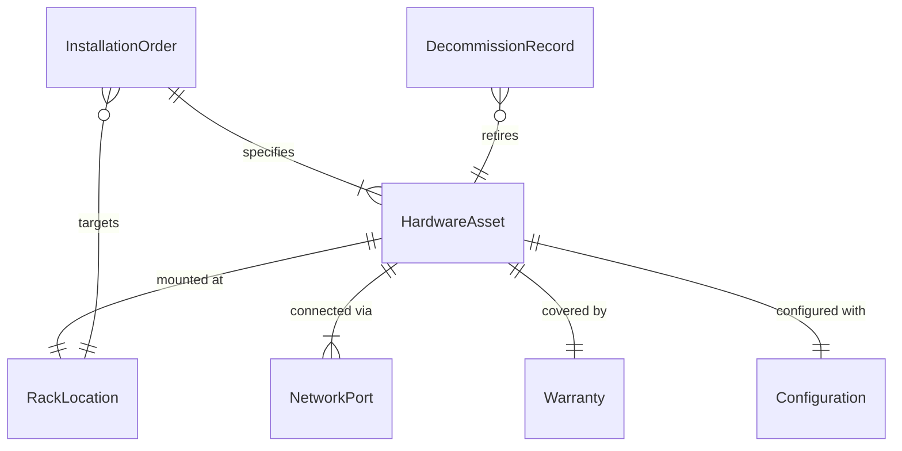
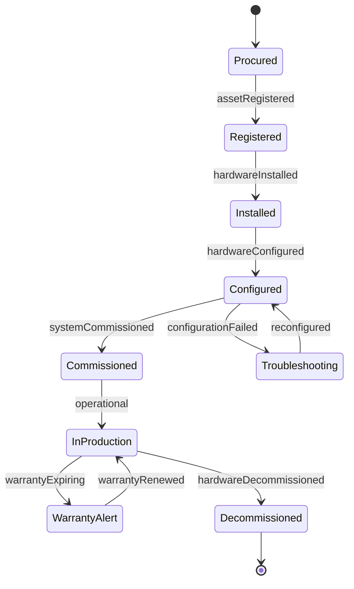
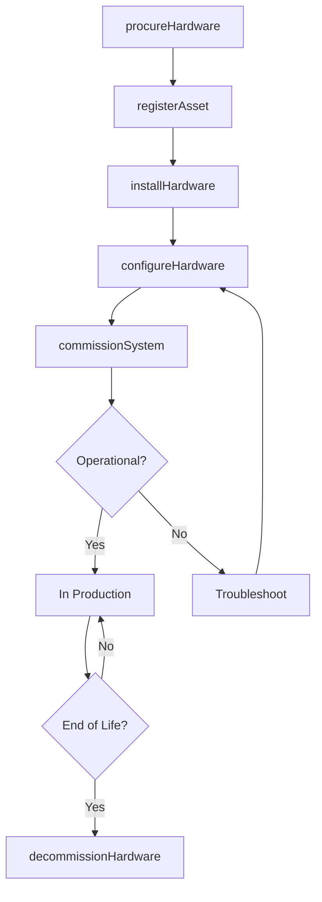
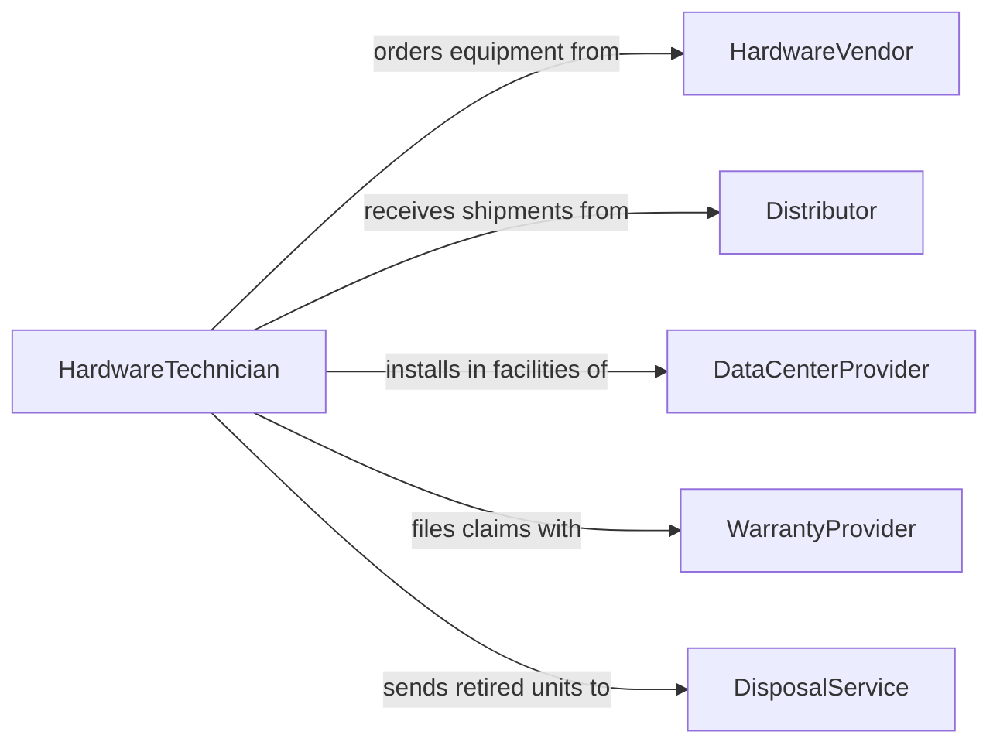

# Install Computer Hardware

> Business-as-Code definition for computer hardware provisioning and installation. Models the lifecycle from procurement and asset tracking through physical installation, configuration, and commissioning.

## Overview

Installing computer hardware involves planning, procuring, physically deploying, and commissioning servers, workstations, networking equipment, and peripherals. This definition exposes actions for hardware lifecycle management, events for asset tracking automation, and searches for inventory and warranty monitoring.

## Actors

| Actor | Description |
|-------|-------------|
| HardwareVendor | Manufactures and supplies servers, workstations, and components |
| Distributor | Provides hardware through channel sales and logistics |
| DataCenterProvider | Hosts collocated or leased rack space for server installations |
| WarrantyProvider | Covers hardware repairs and replacements under service agreements |
| DisposalService | Handles secure decommissioning and recycling of old equipment |

## Roles

| Role | Description |
|------|-------------|
| HardwareTechnician | Physically installs and connects computer equipment |
| NetworkEngineer | Configures network connections for newly installed hardware |
| AssetManager | Tracks hardware inventory, warranties, and lifecycle status |
| ITManager | Approves hardware purchases and installation schedules |

## Entities

| Entity | Description |
|--------|-------------|
| HardwareAsset | A tracked piece of computer equipment with serial and model data |
| InstallationOrder | A work order specifying hardware to be deployed |
| RackLocation | A physical position in a server cabinet or data center |
| NetworkPort | A configured connection point for the installed hardware |
| Warranty | A service agreement covering repairs for the asset |
| Configuration | BIOS, firmware, and OS settings applied during installation |
| DecommissionRecord | Documentation of hardware removal and disposal |

## Actions

| Action | Description |
|--------|-------------|
| procureHardware | Order equipment from vendors or distributors |
| registerAsset | Add the hardware to the asset management inventory |
| installHardware | Physically mount and connect the equipment |
| configureHardware | Apply firmware, BIOS, and network settings |
| commissionSystem | Validate the installed hardware is operational |
| decommissionHardware | Remove and retire equipment from active service |
| transferAsset | Reassign hardware from one location or user to another |

## Events

| Event | Description |
|-------|-------------|
| hardwareProcured | Equipment has been ordered and is expected for delivery |
| assetRegistered | A new hardware asset has been added to inventory |
| hardwareInstalled | Equipment has been physically mounted and connected |
| hardwareConfigured | Firmware and network settings have been applied |
| systemCommissioned | The installed hardware has passed operational validation |
| hardwareDecommissioned | Equipment has been removed from active service |
| warrantyExpiring | A hardware warranty is approaching its expiration date |

## Searches

| Search | Description |
|--------|-------------|
| findAssets | List hardware assets by type, location, or status |
| getInstallationOrders | Retrieve pending or completed installation work orders |
| getWarrantyStatus | Check warranty coverage and expiration for assets |
| findDecommissioned | List retired hardware by date or disposal method |
| getRackUtilization | Query available rack space by data center or cabinet |

## Entity Relationships



## State Diagram



## Workflow



## Actor Relationships



## Usage

### Calling Actions

```typescript
import { installComputerHardware } from '@headlessly/install-computer-hardware'

const hardware = installComputerHardware()

// Register a new server
const asset = await hardware.registerAsset({
  type: 'rack-server',
  model: 'Dell PowerEdge R760',
  serialNumber: 'SVC-2026-48291',
  purchaseDate: '2026-01-15',
  warrantyMonths: 36
})

// Install in the data center
await hardware.installHardware({
  assetId: asset.id,
  location: { dataCenter: 'us-east-1', rack: 'A-14', unit: 22 },
  networkPorts: ['eth0', 'eth1']
})

// Commission the system
const result = await hardware.commissionSystem({
  assetId: asset.id,
  checks: ['power', 'network', 'storage', 'memory']
})
```

### Event-Driven Automation

```typescript
// Alert on expiring warranties
hardware.warrantyExpiring(async ({ assetId, model, expirationDate }) => {
  await notify({
    to: 'procurement',
    message: `Warranty for ${model} (${assetId}) expires ${expirationDate}`
  })
})

// Auto-update inventory on installation
hardware.hardwareInstalled(async ({ assetId, location }) => {
  await inventory.updateLocation({
    assetId,
    status: 'active',
    location
  })
})
```
