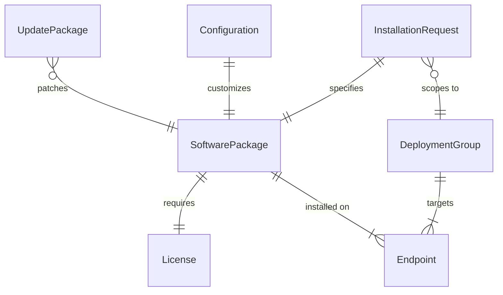
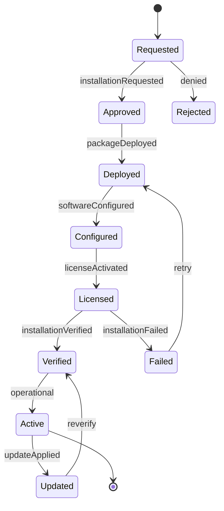
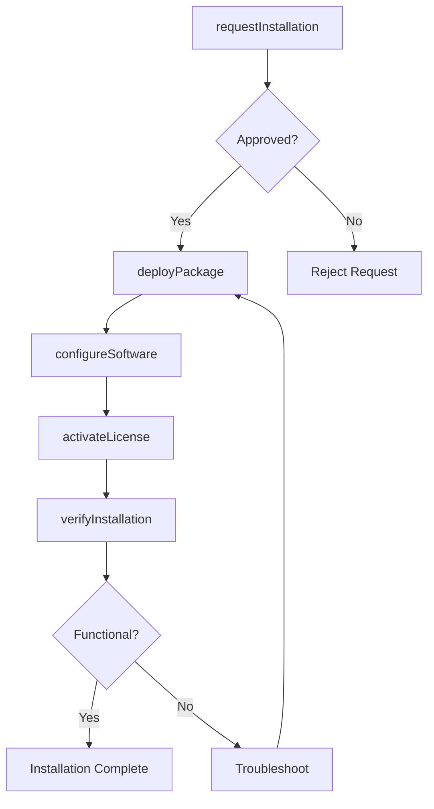
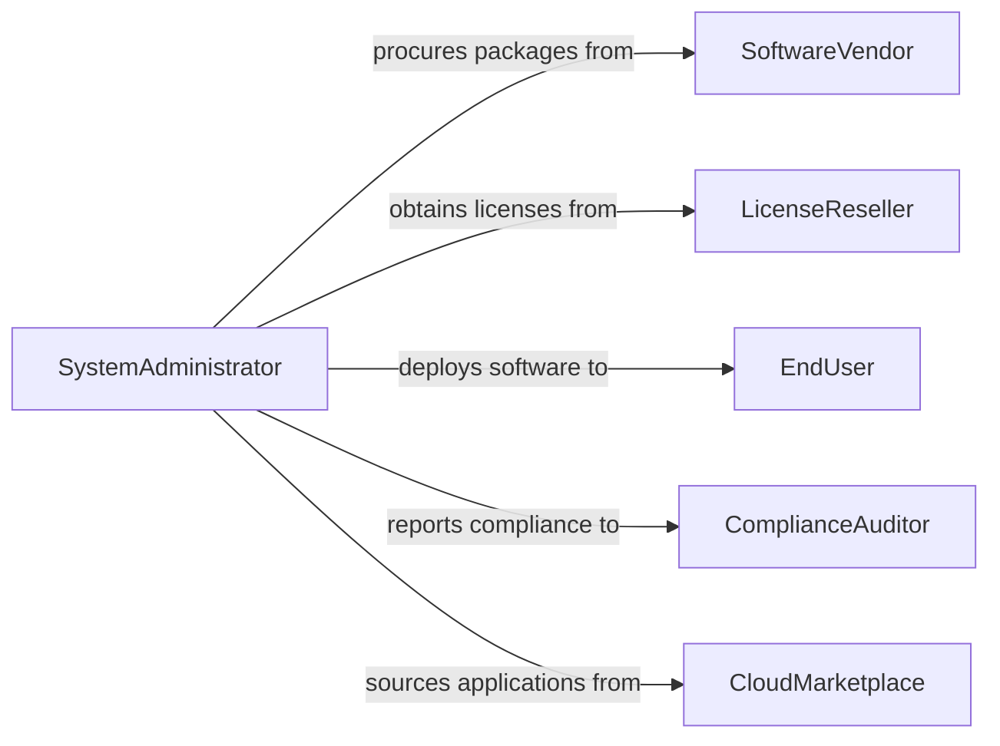

# Install Computer Software

> Business-as-Code definition for software installation and deployment management. Models the lifecycle from procurement through installation, configuration, and license tracking.

## Overview

Installing computer software involves evaluating, deploying, configuring, and maintaining applications across organizational endpoints and servers. This definition exposes actions for package deployment and configuration management, events for installation monitoring, and searches for software inventory and compliance auditing.

## Actors

| Actor | Description |
|-------|-------------|
| SoftwareVendor | Provides application packages, licenses, and updates |
| LicenseReseller | Distributes volume licenses and manages renewals |
| EndUser | Requests and uses the installed software applications |
| ComplianceAuditor | Verifies software licensing and usage compliance |
| CloudMarketplace | Hosts SaaS and downloadable software catalogs |

## Roles

| Role | Description |
|------|-------------|
| SystemAdministrator | Deploys and configures software across endpoints |
| DesktopSupportTechnician | Assists end users with installation issues |
| ITManager | Approves software purchases and deployment policies |
| LicenseAdministrator | Tracks license entitlements and usage |

## Entities

| Entity | Description |
|--------|-------------|
| SoftwarePackage | An installable application bundle with version metadata |
| License | An entitlement granting use of a software product |
| InstallationRequest | A formal request to deploy software to a target system |
| Endpoint | A workstation, server, or device receiving the installation |
| Configuration | Settings applied to the software after installation |
| DeploymentGroup | A set of endpoints targeted for batch installation |
| UpdatePackage | A patch or upgrade to an existing software installation |

## Actions

| Action | Description |
|--------|-------------|
| requestInstallation | Submit a request to install software on a target endpoint |
| deployPackage | Push a software package to one or more endpoints |
| configureSoftware | Apply post-installation settings and preferences |
| activateLicense | Register a license key or entitlement for the installed product |
| verifyInstallation | Confirm the software is installed and functioning correctly |
| updateSoftware | Apply patches or version upgrades to installed applications |
| uninstallSoftware | Remove a software product from a target endpoint |

## Events

| Event | Description |
|-------|-------------|
| installationRequested | A new software installation request has been submitted |
| packageDeployed | A software package has been pushed to the endpoint |
| softwareConfigured | Post-installation settings have been applied |
| licenseActivated | A software license has been registered and verified |
| installationVerified | The software has been confirmed operational |
| updateApplied | A patch or upgrade has been installed successfully |
| installationFailed | The deployment process encountered an error |

## Searches

| Search | Description |
|--------|-------------|
| findInstalledSoftware | List software by endpoint, version, or vendor |
| getLicenseInventory | Retrieve license entitlements and usage counts |
| getPendingInstallations | Query outstanding installation requests by status |
| findOutdatedSoftware | List endpoints running versions below the latest release |
| getDeploymentHistory | Retrieve past installations by date, package, or group |

## Entity Relationships



## State Diagram



## Workflow



## Actor Relationships



## Usage

### Calling Actions

```typescript
import { installComputerSoftware } from '@headlessly/install-computer-software'

const software = installComputerSoftware()

// Deploy an application to a group of workstations
const deployment = await software.deployPackage({
  package: 'microsoft-office-365',
  version: '16.0.17726',
  targets: ['ws-eng-01', 'ws-eng-02', 'ws-eng-03'],
  silent: true
})

// Activate the license
await software.activateLicense({
  deploymentId: deployment.id,
  licenseKey: 'XXXXX-XXXXX-XXXXX-XXXXX',
  type: 'volume'
})

// Verify the installation
const status = await software.verifyInstallation({
  deploymentId: deployment.id,
  checks: ['launch', 'version', 'license']
})
```

### Event-Driven Automation

```typescript
// Auto-update on new patch availability
software.updateApplied(async ({ packageName, version, endpoints }) => {
  await auditLog.record({
    event: 'software-updated',
    packageName,
    version,
    endpointCount: endpoints.length
  })
})

// Alert on failed installations
software.installationFailed(async ({ packageName, endpoint, error }) => {
  await notify({
    to: 'desktop-support',
    message: `Installation of ${packageName} failed on ${endpoint}: ${error}`
  })
})
```
