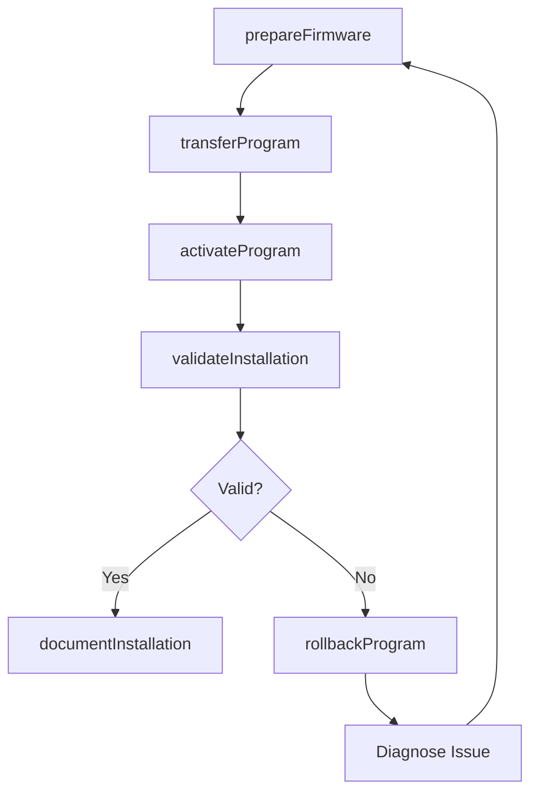
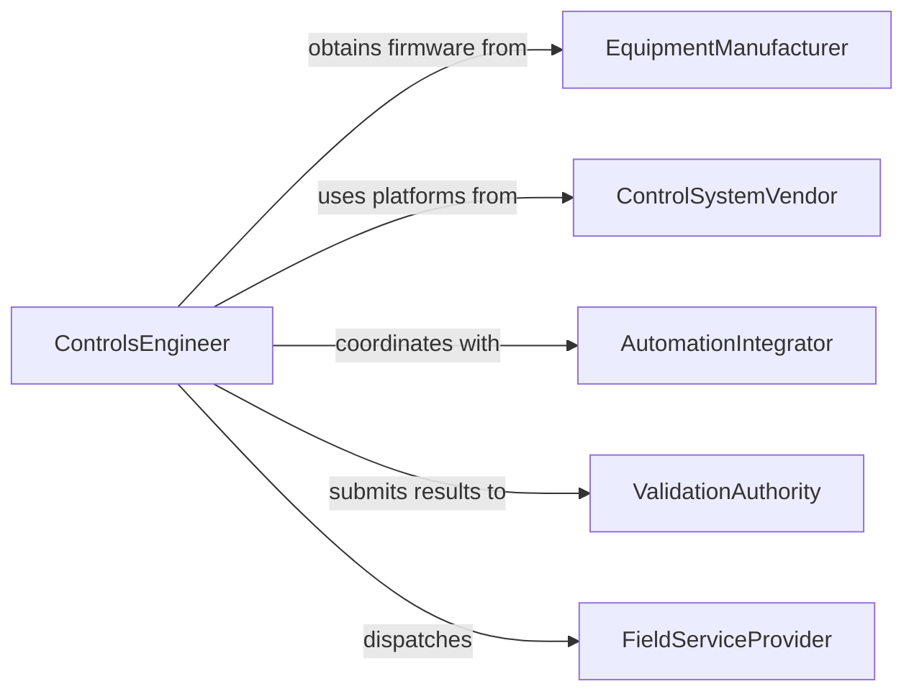

# Install Programs onto Computer or Computer-Controlled Equipment

> Business-as-Code definition for deploying software to computer-controlled machinery and embedded systems. Models the lifecycle from firmware preparation through installation, validation, and version management.

## Overview

Installing programs onto computer-controlled equipment involves loading firmware, control software, and application programs onto PLCs, embedded controllers, CNC machines, and other automated systems. This definition exposes actions for program transfer and activation, events for deployment tracking, and searches for installed program inventories across equipment fleets.

## Actors

| Actor | Description |
|-------|-------------|
| EquipmentManufacturer | Provides firmware packages and installation procedures |
| ControlSystemVendor | Supplies PLC and SCADA software platforms |
| AutomationIntegrator | Configures multi-device installations and integration |
| ValidationAuthority | Certifies installed software meets operational specifications |
| FieldServiceProvider | Performs on-site installations and upgrades |

## Roles

| Role | Description |
|------|-------------|
| ControlsEngineer | Develops and installs programs for computer-controlled equipment |
| FieldTechnician | Performs physical installation and firmware loading on site |
| SystemIntegrator | Coordinates program deployment across interconnected equipment |
| QualityEngineer | Validates installed programs produce correct operational output |

## Entities

| Entity | Description |
|--------|-------------|
| FirmwarePackage | A binary image loaded onto equipment controllers |
| ControlProgram | Logic instructions executed by a PLC or embedded system |
| EquipmentController | The computing unit receiving the installed program |
| InstallationManifest | A record of all programs deployed to a specific machine |
| ValidationReport | Documentation confirming the installed program operates correctly |
| RollbackImage | A prior program version retained for recovery purposes |
| DeploymentLog | A chronological record of program installations and updates |

## Actions

| Action | Description |
|--------|-------------|
| prepareFirmware | Package and verify the program image for deployment |
| transferProgram | Upload the program to the target equipment controller |
| activateProgram | Enable the installed program for operational execution |
| validateInstallation | Run diagnostics to confirm the program operates correctly |
| rollbackProgram | Revert to a previous program version after a failed upgrade |
| updateFirmware | Apply a newer version of the control program |
| documentInstallation | Record the installation details in the deployment manifest |

## Events

| Event | Description |
|-------|-------------|
| firmwarePrepared | A program image has been packaged for deployment |
| programTransferred | The program has been uploaded to the controller |
| programActivated | The installed program is now executing on the equipment |
| installationValidated | Diagnostics confirm the program is functioning correctly |
| installationFailed | The program transfer or activation encountered an error |
| programRolledBack | The equipment has reverted to a prior program version |
| firmwareUpdated | A newer version of the program has been installed |

## Searches

| Search | Description |
|--------|-------------|
| findInstalledPrograms | List programs by equipment, version, or installation date |
| getDeploymentLogs | Retrieve installation history for a specific machine |
| findOutdatedFirmware | List equipment running below the current program version |
| getValidationReports | Query validation outcomes by equipment or program |

## Workflow



## Actor Relationships



## Usage

### Calling Actions

```typescript
import { installProgramsOntoComputerComputerControlled } from '@headlessly/install-programs-onto-computer-computer-controlled'

const installer = installProgramsOntoComputerComputerControlled()

// Prepare a firmware package
const firmware = await installer.prepareFirmware({
  source: 'plc-programs/line-3-conveyor-v2.1',
  targetController: 'allen-bradley-5069',
  checksum: true
})

// Transfer and activate
await installer.transferProgram({
  firmwareId: firmware.id,
  controllerId: 'plc-line3-conv-01',
  method: 'ethernet-ip'
})

await installer.activateProgram({
  controllerId: 'plc-line3-conv-01',
  mode: 'run'
})
```

### Event-Driven Automation

```typescript
// Alert on installation failure
installer.installationFailed(async ({ controllerId, error }) => {
  await notify({
    to: 'controls-engineering',
    message: `Program installation failed on ${controllerId}: ${error}`
  })
  await installer.rollbackProgram({ controllerId })
})

// Log successful deployments
installer.programActivated(async ({ controllerId, programVersion }) => {
  await auditLog.record({
    event: 'program-activated',
    controllerId,
    version: programVersion
  })
})
```
